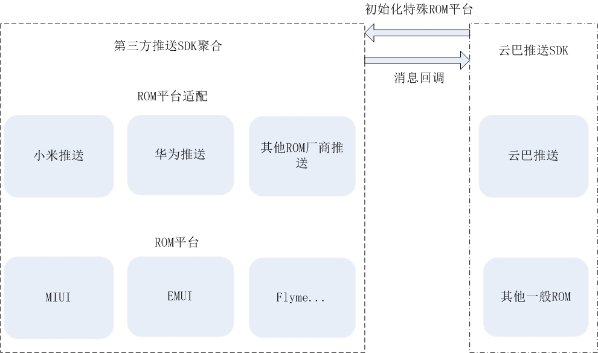

##AndroidPushIntegration
>Android平台上整合各大ROM厂商推送SDK的平台，目前支持MIUI、EMUI。它屏蔽了这些ROM厂商提供的推送SDK的底层细节，向上提供简单易用的统一接口。可以和云巴SDK完美的结合，也可以和开发者自身的私有推送服务结合使用。

####与云巴SDK交互示意图


####多线路推送
AndroidPushIntegration只管理支持的ROM平台的推送。换句话说，开发者可以决定选择多条线路推送。比如：对于小米，AndroidPushIntegration会初始化和管理小米推送，开发者也可以使用自己的推送服务。

####示例
```
        PushManager.start(this, new PushCallback() {
            @Override
            public HashMap<String, Object> getRegisterParams() {
                return null;
            }

            @Override
            public void onMessaheReceived(UniformMessage result) {

            }

            @Override
            public void onRegisterResult(long errCode, String regId) {

            }
        });
```

